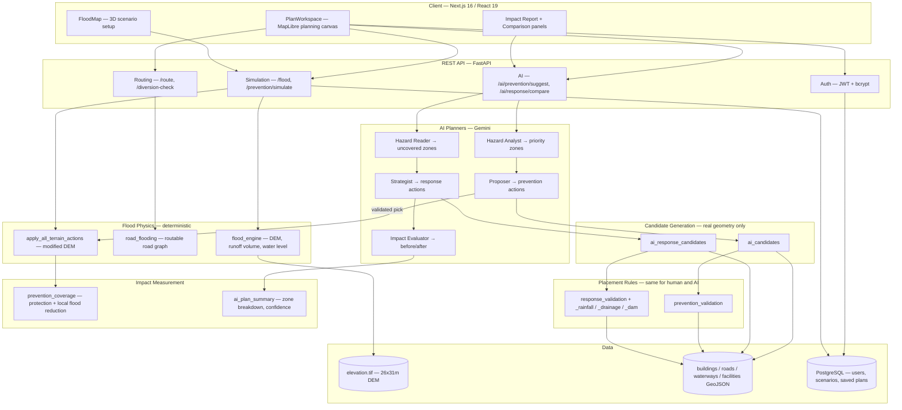

# MOHAFIZ

**Flood scenario planning for Islamabad's Nullah Leh / Korang Nullah corridor — on real terrain, with a plan you can measure.**

Every disaster plan is a guess until it's tested. MOHAFIZ lets you run a real flood
scenario over a real digital elevation model, draw a response or prevention plan on the
map, and see the risk change — before the water gets there.

---

## What makes it different

**The AI never gets to assert that something is true. It only proposes.**

That one rule shapes the whole architecture. A language model is good at judgement —
*which* of these places is worth protecting — and bad at facts it can't check. So the
model is never allowed to produce a coordinate, a distance, or an impact number. It picks
an **id** from a list of real candidate points generated from real geometry, and the app's
own deterministic code does the rest:

| Step | Who does it | Guarantee |
|---|---|---|
| Enumerate candidate points | Deterministic, from OSM + DEM geometry | Never a hallucinated lat/lon |
| Choose among them | Gemini | Judgement only, by id |
| Validate the choice | The **same** rules a human click faces | AI can't bypass a rule you can't |
| Compute the impact | Real terrain physics, re-run on modified DEM | No LLM-authored numbers |

If every candidate fails validation, the app says so and explains which rule rejected it.
"Zero proposals" is a legitimate, meaningful answer here — not an error to paper over.

---

## The data is real

| Layer | Scale |
|---|---|
| Digital elevation model | 234 × 270 raster, **26 m × 31 m** per pixel |
| Study catchment | **50.3 km²** |
| Buildings | **4,925** footprints |
| Road network | **11,467** segments — a routable graph of 4,683 nodes |
| Waterways | 215 features, **56.2 km** of channel inside the catchment |
| Facilities | Hospitals, schools, shelters, mosques (used as real snap targets) |

Flood extent is solved from terrain, not drawn: rainfall becomes a runoff volume, the
volume is matched against the DEM's own hypsometry to find a water level, and everything
downstream — flooded area, roads cut, buildings affected, depth — is sampled from that
surface.

---

## Four scenarios, each with its own physics and its own rules

| Scenario | What it models | What "at risk" means |
|---|---|---|
| **River overflow** | Nullah breaching its banks | Buildings inside the modelled flood extent |
| **Rainfall** | Monsoon rain outpacing urban drainage (PMD bands) | Buildings in mapped drainage-risk zones |
| **Drainage failure** | Blocked drains, encroached nullahs | Wet road junctions and risk-zone area |
| **Dam release** | Rawal Dam spillway into Korang Nullah | Time-tiered wave-arrival zones |

Each scenario has its own action set, its own validators, and its own definition of
coverage — they are not one model with different labels.

---

## Two AI planners

**Prevention** — Hazard Analyst → Proposer
Picks priority zones from real simulation stats, then proposes embankments, retention
basins, channel widening, desilting, drain clearance and green buffers. Every proposal is
validated against the real placement rules and simulated on a modified DEM.

**Response** — Hazard Reader → Strategist → Impact Evaluator
Reads the live simulation *and your current plan*, proposes what's still uncovered
(evacuation zones, warning points, road closures, boat launches, relief posts), then
computes before/after coverage from one function called twice — so the two columns can
never drift apart.

### Measuring impact honestly

A retention basin holds a few thousand cubic metres. The catchment holds millions. So
basin-wide flooded area barely moves — and reporting *only* that made every plan look
useless. MOHAFIZ reports impact at the scale each measure actually acts on:

- **Protection coverage** — of the buildings genuinely exposed to this flood, how many now
  sit inside a real measure's real service reach. Typically **0% → ~50%**.
- **Local flood reduction** — the same two flood masks restricted to the ground the plan
  actually raises. Typically **≈80% under water → ≈65%**, a ~20% cut.
- **Basin-wide extent** — still shown, still honest, with the caveat stated on screen.

Numbers that can't be computed honestly are not shown. There is no "lives saved" figure,
because nothing in the data supports one.

---

## Architecture



**How a plan is produced.** The Hazard Analyst reads real simulation stats and names
priority zones. Candidate generators enumerate real points inside those zones — on the
channel, offset onto its banks, on road segments, at facilities. Gemini picks **ids** from
that list. Every pick runs through the *same* validators a human click faces, and the
impact is a real recomputation on a modified DEM. The model never emits a coordinate or a
number.

---

## Project structure

```
MOHAFIZ/
├─ Backend/                          FastAPI + flood physics + AI planners
│   ├─ main.py                       14 REST endpoints, simulation orchestration
│   ├─ database.py                   SQLAlchemy models (users, scenarios, saved plans)
│   │
│   ├─ flood_engine.py               DEM, runoff volume → water level, terrain edits
│   ├─ road_flooding.py              Routable road graph, flood-cut segments
│   ├─ routing.py                    Evacuation routing, diversion checks
│   │
│   ├─ prevention_validation.py      Placement rules for prevention actions
│   ├─ prevention_constants.py       Real thresholds, per-scenario action weights
│   ├─ response_validation.py        River-overflow response rules
│   ├─ response_validation_rainfall.py
│   ├─ response_validation_drainage.py
│   ├─ response_validation_dam.py
│   │
│   ├─ ai_llm.py                     Gemini client, shared rate limiter, JSON contract
│   ├─ ai_hazard_analyst.py          Agent 1 — priority zones from real stats
│   ├─ ai_candidates.py              Real candidate points (prevention)
│   ├─ ai_proposer.py                Agent 2 — validated prevention proposals
│   ├─ ai_response_hazard_reader.py  Agent 1 — what your plan leaves uncovered
│   ├─ ai_response_candidates.py     Real candidate points (response)
│   ├─ ai_response_strategist.py     Agent 2 — validated response proposals
│   ├─ ai_response_evaluator.py      Agent 3 — before/after coverage
│   ├─ ai_plan_summary.py            Zone breakdown, transparent confidence score
│   ├─ prevention_coverage.py        Protection coverage + local flood reduction
│   │
│   ├─ elevation.tif                 234 x 270 DEM @ 26m x 31m
│   ├─ buildings.geojson             4,925 footprints
│   ├─ waterways.geojson             215 features, 56.2 km in catchment
│   ├─ facilities.geojson            Hospitals, schools, shelters, mosques
│   ├─ water_bodies.geojson  greenery.geojson
│   └─ requirements.txt
│
└─ Frontend/mohafizweb/              Next.js 16 (Turbopack) + React 19
    └─ src/
        ├─ app/                      Routes: /, /map, /plan, /my-plans, /login, ...
        └─ components/
            ├─ FloodMap.js               3D scenario setup + simulation
            ├─ PlanWorkspace.js          Planning canvas, tools, validation, reports
            ├─ PreventionPlanPanel.js    AI prevention proposals
            ├─ ResponseComparisonPanel.js AI response proposals + before/after
            └─ ResponseImpactModal.js    Response Impact Report
```

---

## Tech stack

**Backend** — Python / FastAPI `0.141`
`rasterio` (DEM), `shapely` `2.1` + STRtree (geometry, spatially indexed), `numpy`
(raster maths), `networkx` + `osmnx` (routable road graph), `SQLAlchemy` `2.0` +
PostgreSQL, `python-jose` JWT + `bcrypt`, `google-genai` (Gemini).

**Frontend** — Next.js `16.3` (Turbopack) / React `19.2`
`maplibre-gl` `5.24` (3D terrain + interactive planning), `deck.gl` `9.3`, `@turf/turf`
`7.4` (client-side geometry), Tailwind CSS `4`.

**14 REST endpoints**, including `/flood`, `/prevention/simulate`, `/prevention/breakdown`,
`/ai/prevention/suggest`, `/ai/response/compare`, `/route`, `/embankment-compare`.

---

## Engineering worth a look

- **390× validation speedup** — spatial cache + bbox branch-and-bound pruning took
  placement validation from ~12 s to ~0.03 s, with identical answers.
- **1,148× faster candidate generation** — `nearest_road` rebuilt geometry for all 11,467
  roads on every call, and one generator calls it once per facility: it measured **2,871 s**
  for a single action type in a single zone. A cached STRtree with a radius
  that grows until the nearest match is *provably* inside it: **2,873 s → 2.5 s**, verified
  identical on 42 probe points. (The naive fixed-radius version was 261× faster and *wrong*
  on 2 of them — speed alone wasn't the bar.)
- **Sub-pixel measures were invisible** — embankments used an 8 m buffer on a 26×31 m grid,
  so a real 180 m wall raised **zero pixels**. Floored at half a pixel diagonal.
- **Greedy marginal coverage** ranks candidates by how many *still-uncovered* at-risk
  buildings each would protect, so the model is choosing between genuinely different
  options rather than fifteen neighbours.
- **Rate-limit aware** — one shared 60 s window across all agents, deadline-aware waiting,
  and partial results returned rather than a failed request.

---

## Running it

**Backend**
```bash
cd Backend
python -m venv ../venv && ../venv/Scripts/activate     # Windows
pip install -r requirements.txt
python -m uvicorn main:app --host 127.0.0.1 --port 8002
```

**Frontend**
```bash
cd Frontend/mohafizweb
npm install
npm run dev
```

Open http://localhost:3000.

`Backend/.env` needs `DATABASE_URL`, `SECRET_KEY`, `GEMINI_API_KEY`, and optionally
`GEMINI_MAX_CALLS_PER_MIN` (default 8) and `AI_SUGGEST_TIME_BUDGET_S` /
`AI_RESPONSE_TIME_BUDGET_S` (default 300).

---

> MOHAFIZ is a planning tool. For a real emergency in Pakistan, call **Rescue 1122**.
